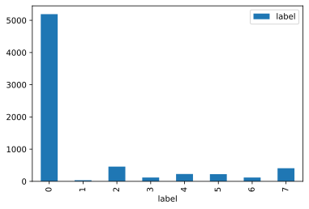
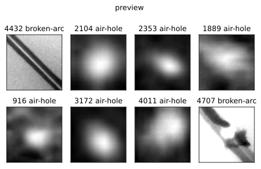
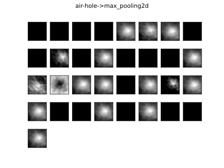
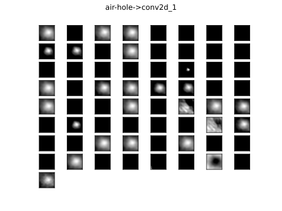
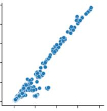

# 数据挖掘结课作业报告

[TOC]

## 1 分析思路
### 1.1 假定任务
完成**钢管焊缝缺陷分类**任务。

### 1.2 数据集

#### 1.2.1 描述性数据集（dataset.csv）

*数据集来源：由YOLO格式的图像检测数据集生成，Python源代码在`generate_csv.py`文件中。*

钢管焊缝缺陷样本统计如下：



| EN     | air-hole | bite-edge | broken-arc | crack | hollow-bead | overlap | slag-inclusion | unfused |
| ------ | -------- | --------- | ---------- | ----- | ----------- | ------- | -------------- | ------- |
| ZH     | 气孔     | 咬边      | 断弧       | 裂缝  | 夹珠        | 焊瘤    | 夹渣           | 未融合  |
| Label  | 0        | 1         | 2          | 3     | 4           | 5       | 6              | 7       |
| Number | 5191     | 35        | 458        | 119   | 229         | 223     | 120            | 408     |

#### 1.2.2 钢管焊缝缺陷图像分类数据集（dataset.pkl）

*数据集来源：由PASCAL VOC格式的图像检测数据集生成，Python源代码在`utils.py`文件中。*

数据格式如下：

``` json
{
	"train_labels": ["air-hole", "bite-edge", "broken-arc"],
	"train_images": [
		[0, 255],
		[0, 254],
		[0, 253,0,252]
	],
	"test_labels": ["air-hole", "broken-arc"],
	"test_images": [
		[0, 255],
		[0, 253,0,252]
	]
}
```

样本图像预览如下：



#### 1.2.3 钢管焊缝缺陷检测数据集

*数据集来源：使用**Labelme**或者**LabelImage**手动标注。*

导出为YOLO格式或者PASCAL VOC格式的数据集。

## 2 技术难点 & 解决办法

### 2.1 样本过多，标注费时费力

#### 2.1.1 问题描述

在制作缺陷检测数据集的过程中需要使用**Labelme**或者**LabelImage**手动标注缺陷图片，大概有**4000**多张图。，标注完之后要手动按键盘切换图片，不仅耗费了大量的时间而且加剧了手部的疲劳。

#### 2.1.2 解决办法

在考虑到本人鼠标没有鼠标宏的情况下（需要鼠标硬件和驱动程序支持），想到可以用**Python脚本**写一个简单的鼠标宏程序用**鼠标右键**来代替按键操作，实现**保存当前数据**并且**切换下一张图片**的功能。

主要用到`pyHook`、`pynput`这两个包，Python源代码如下：

``` python
# -*- coding: utf-8 -*
import pyHook
import pythoncom
import win32gui

from pynput.keyboard import Key, Controller
keyboard = Controller()

def onMouseEvent(event):
    if(event.MessageName=="mouse right down"):
        print("mouse right down")
        keyboard.press(Key.ctrl_l)
        keyboard.press('s')
        keyboard.release('s')
        keyboard.release(Key.ctrl_l)
        
        keyboard.press(Key.right)
        keyboard.release(Key.right)
        return False
    return True

def main():
    hm = pyHook.HookManager()
    hm.MouseAll = onMouseEvent   
    hm.HookMouse()
    win32gui.PumpMessages()

if __name__ == "__main__":
    main()
```

#### 2.1.3 结果

标注效率大大提高，在进入工具人模式的情况下平均一天标注**700**多张图片，**一个星期**就标注完了。Python yyds:triumph:。

### 2.2 怎么描述图像特征

从[stackexchange](https://stats.stackexchange.com/questions/291820/what-is-the-definition-of-a-feature-map-aka-activation-map-in-a-convolutio)网站上可以找到特征图（feature map）的定义：

> **Feature map** and **activation map** mean exactly the same thing. It is called an activation map because it is a mapping that corresponds to the activation of different parts of the image, and also a feature map because it is also a mapping of where a certain kind of feature is found in the image. A high activation means a certain feature was found.

自建的CNN结构如下：

``` bash
Model: "sequential"
_________________________________________________________________
Layer (type)                 Output Shape              Param #
=================================================================
conv2d (Conv2D)              (None, 48, 48, 32)        320
_________________________________________________________________
max_pooling2d (MaxPooling2D) (None, 24, 24, 32)        0
_________________________________________________________________
conv2d_1 (Conv2D)            (None, 22, 22, 64)        18496
_________________________________________________________________
max_pooling2d_1 (MaxPooling2 (None, 11, 11, 64)        0
_________________________________________________________________
flatten (Flatten)            (None, 7744)              0
_________________________________________________________________
dropout (Dropout)            (None, 7744)              0
_________________________________________________________________
dense (Dense)                (None, 50)                387250
_________________________________________________________________
dense_1 (Dense)              (None, 8)                 408
=================================================================
Total params: 406,474
Trainable params: 406,474
Non-trainable params: 0
_________________________________________________________________
```

**conv2d**、**max_pooling2d**、**conv2d_1**、**max_pooling2d_1**的特征图分别如下（最后一张是原图，用作对比）：







### 2.3 怎么提高CNN或者RCNN的检测精度

#### 2.3.1 问题描述

在CNN中因为有**全连接层（dense）**的存在，所以输入的图像要**缩放到统一的宽高**，但无论是使用什么样的**缩放算法**，必定会**损失图像的一部分信息**，从而导致分类准确率或检测精度的**下降**。

#### 2.3.2 解决办法

现在主流的解决办法有：

| 方法                                            | 描述                                                   |
| ----------------------------------------------- | ------------------------------------------------------ |
| 全卷积网络（Fully Convolutional Networks，FCN） | 用卷积层替换全连接层                                   |
| 网中网（Network In Network）                    | 用全局平均池化（Global Average Pooling）层替换全连接层 |
| 空间金字塔池化（Spatial Pyramid Pooling，SPP）  | 在全连接层之前加入SPP，保证输入全连接层的是固定的维数  |

如下图所示，boundingbox的长宽是**正相关**的，缩放图片会损失长宽信息和一部分图像信息。



可以在输入**图像的后面增加两个长宽的信息**，由于**量纲不同**（一个是灰度，一个是px），所以要**归一化（normalization）**处理。然后添加一个全连接层，全连接层后面再reshape成统一长宽，然后才是conv2d。

结构如下：

``` bash
image+bnd_width+bnd_height -> dense -> reshape -> conv2d -> max_pooling2d -> ... -> dense_1
```

直觉来说，这样的改进由于**加入了图片的长宽信息**会大大**提高**CNN的分类准确率或RCNN的检测精度，事实有待后面进一步进行**对比实验**。

## 3 心得体会

1. 以项目为导向的研究能加快学习进程，有针对性地学习相关领域的知识比漫无目的地阅读各种文献要快得多；
2. 解决问题比提出问题要简单得多；
3. 办法总比困难多，一条路走不通的时候不妨换一个角度思考问题。